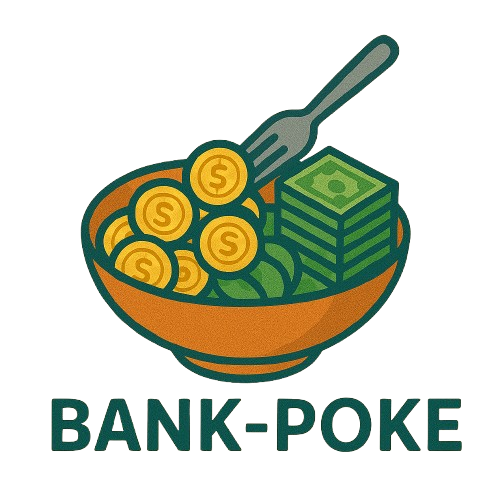

# Solo-Leveling

<div align="center">


</div>

# Bank-Poke
> KB It's Your Life 6기 스켈레톤 프로젝트  <br/> **개발기간: 2025.04.07 ~ 2025.04.11**

## 배포 주소

> **프론트 서버** : 추후 주소 추가<br>


## 웹개발팀 소개

|        강영광     |        김태영       |       강지호        |       조승훈        |                                                                                                       
| :--------------: | :--------------------: | :----------------: | :------------------: |  
|       |      |        |     |
|   [@glorypang](https://github.com/glorypang)   |    [@kimdavid0521](https://github.com/kimdavid0521)  | [@dudujh0106](https://github.com/dudujh0106)  |  [@cho-seung-hoon](https://github.com/cho-seung-hoon)
| KB It's Your Life 6기 | KB It's Your Life 6기 | KB It's Your Life 6기 | KB It's Your Life 6기 |

## 프로젝트 소개

소비를 기록하고, 자산을 관리하며, 더 나은 금융 습관을 만들어가는 첫걸음!
BankPoke는 가계부 작성을 쉽고 즐겁게 도와주는 웹 서비스입니다.

## 시작 가이드
### Requirement

해당 프로젝트를 실행하기 위해 아래 환경이 필요합니다:

- [Node.js 18+](https://nodejs.org/)  
- [npm 9+](https://www.npmjs.com/)
- [json-server](https://github.com/typicode/json-server) (로컬 API 서버용)
- [Vue 3](https://vuejs.org/) (Vite 기반)
- **Bootstrap 5** (CDN 또는 npm 설치)
- **Fontawesome** (CDN 또는 npm 설치)


### Installation
``` bash
$ git clone https://github.com/your-username/BankPoke.git
$ cd BankPoke
```
#### Backend
```
$ npx json-server db.json
```

#### Frontend
```
$ cd BankPole
$ npm install 
$ npm run dev
```

---

## Stacks 🐈

###  Development Environment


---

###  Config & Package


---

###  Frontend


---

### Communication & Collaboration


---

### 📝 Version Control & Deployment


---
## 화면 구성 📺
| 로그인 페이지  |  가계부 페이지   |
| :-------------------------------------------: | :------------: | 
|   |  |  
| 거래내역 페이지   |  분석 페이지   |  
|    |       |
| 자산 페이지   |  마이페이지 페이지   |  
|   |       |

---

## 주요 기능 📦

### ⭐️ 가계부 작성
- 수입/지출 내역을 간편하게 작성 및 수정 가능
- 작성된 거래는 달력에 시각적으로 표시되어 한눈에 파악

### ⭐️ 거래 내역 관리
- 모든 거래 내역을 리스트 형식으로 확인 가능
- 날짜, 금액, 자산, 카테고리 등 다양한 조건으로 **필터링/검색** 기능 제공

### ⭐️ 통계 분석
- 월별 소비 통계, 카테고리별 지출 비율 등 다양한 시각화 제공
- 예산 대비 현재 지출 상황을 한눈에 확인 가능

### ⭐️ 마이페이지
- 회원 정보 수정 (닉네임, 이메일 등)
- 카테고리(수입/지출)의 **자유로운 추가 및 삭제**
- 월별 예산 설정
- 프리미엄 가입 및 상태 확인

### ⭐️ 자산 관리
- 계좌/카드/기타 자산 등록 및 수정
- 각 자산별 잔액, 카드 마이너스 한도, 결제일 관리 가능

### ⭐️ 고정 지출 설정
- 반복되는 지출/수입을 고정 지출로 등록 가능
- 반복 주기 설정 (매일, 매주, 매월 등)
- **출금 예정일이 다가오면 알림 표시**

### ⭐️ 알림 기능 🔔
- 월 예산 90% 도달 시 경고 알림
- 카드 결제일 임박 시 알림
- 고정 지출 예정일 알림

### 🛡️ 프리미엄 기능 제한
- 프리미엄 미가입자는 **일부 기능 접근 제한**
  - 예: 분석 페이지 접근 불가 (🔒 자물쇠 아이콘 표시)


---
## 아키텍쳐

### 디렉토리 구조
```bash
│  App.vue
│  main.js
│
├─assets
│      bankPoke.png
│      bankPoke1.png
│      main.css
│      user-2935527_1280.png
│
├─components
│      AddAsset.vue
│      AddExpenseModal.vue
│      Alarm.vue
│      BudgetProgress.vue
│      Calender.vue
│      CancleAccountModal.vue
│      CategoryExpenseChart.vue
│      CategoryIncomeChart.vue
│      DailyExpenseChart.vue
│      ForgotPassword.vue
│      Header.vue
│      Loading.vue
│      LoginForm.vue
│      MinusAsset.vue
│      MyAccount.vue
│      ProPaymentModal.vue
│      RetrieveAsset.vue
│      SearchBox.vue
│      SignUp.vue
│      TableLayout.vue
│      TimeOut.vue
│      UpdateAsset.vue
│
├─pages
│  │  Analyze.vue
│  │  Asset.vue
│  │  Login.vue
│  │  Main.vue
│  │  Mypage.vue
│  │  NotFound.vue
│  │  TransactionList.vue
│  │
│  └─MypageSub
│          Budget.vue
│          CancleAccount.vue
│          EditProfile.vue
│          ExpenseCategory.vue
│          FixedExpense.vue
│          IncomeCategory.vue
│          Premium.vue
│
├─router
│      index.js
│
└─stores
        assetStore.js
        auth.js
        chartStore.js

```


